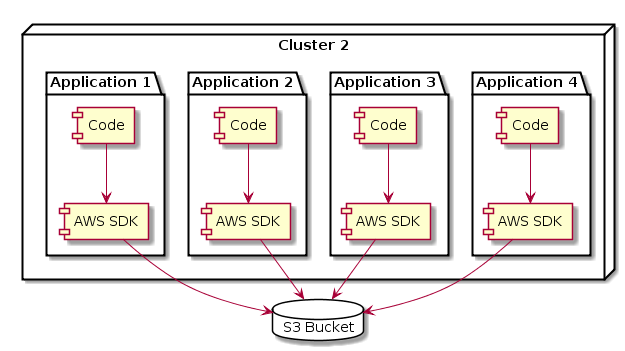
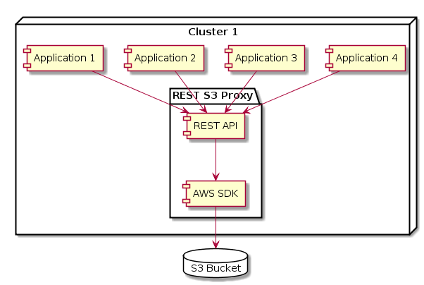

# REST S3 Proxy [](https://travis-ci.org/pwhittlesea/rest-s3-proxy)
Application to provide S3-backed persistent storage to a cluster using HTTP REST.

## Current Support

### HTTP Methods

| Method  | Supported    |
|:-------:|:------------:|
| GET     | Yes          |
| PUT     | Yes          |
| DELETE  | Yes          |
| HEAD    | No (planned) |
| POST    | No           |
| TRACE   | No           |
| CONNECT | No           |
| OPTIONS | No           |

### HTTPS
No (planned).

## Why?
#### Q) Why do I want a proxy around S3? Amazon provides an SDK right?
Yes, that is true.
Amazon does make it relatively easy to interact with an S3 bucket from inside your code using the AWS SDK.

But what if you wanted to run your cluster on another architecture that didn't include S3 but another persistence mechanism?
What if you wanted to test your application locally?
You have now added the AWS SDK into all of your applications and to change to another persistence layer will require a code change in all these services.

#### Q) But S3 is a web-based API. I could just call it without using the SDK!
Yes, you could. But S3 requires all requests to be signed which means you have to distribute your S3 credentials (or at least the code for signing) across all of your services.

*Having a specific application in the cluster that is responsible for providing all others with a simple REST-based persistence mechanism isolates that concern and makes changing that layer simpler.*

This assumes of course that services running within the cluster can be trusted and that others cannot get into it (correct security groups).

The images below are a good example of how moving this responsibility to a single component:

##### Before
All application in the cluster take on the responsibility of talking to S3 and the complexity that that comes with (authentication etc.).
This increases the size of all applications in the cluster as they need the SDK/authentication code.



##### After
A single application (that you control) is responsible for talking to S3 and others no longer need the SDK/authentication code, thus simplifying the cluster.
Only one application needs the SDK whilst others only need to make RESTful requests.



#### Q) Doesn't this create a single point of failure?
No.
None of the REST requests being made are in a tunnel and as such (assuming you are running multiple instances of the proxy) each subsequent request can be made to a different proxy.
Ideally this will be handled by whatever service discovery mechanism you use in your cluster.

Overall, this means that if you lose a proxy instance you should not see massive issues in the cluster (assuming you error handle single failed requests correctly).

## Example
Given a S3 bucket named ***my-bucket*** with a file in it called ***my-file.xml***.

Starting the proxy with the bucket as the *AWS_BUCKET* argument you should be able to make a HTTP GET request to http://localhost:8000/my-file.xml and get the contents of ***my-file.xml*** back.

## Building
Run the following to checkout dependencies:
```
go get -u github.com/aws/aws-sdk-go/...
```

## Running
The application requires several environment variables in order to run.
Below is an example execution:

```
PORT=9999 \
AWS_REGION=the-region \
AWS_ACCESS_KEY_ID=<redacted> \
AWS_SECRET_ACCESS_KEY=<redacted> \
AWS_BUCKET=the-bucket-name \
./rest-s3-proxy
```

### Arguments
#### PORT
The port number the application will listen on.

*Optional - Default: 8000*

#### AWS_REGION
The AWS region the bucket resides in.

*Optional - Default: eu-west-1*

#### AWS_ACCESS_KEY_ID
The access key ID for AWS authentication.
**Must** have S3 read (and write if HTTP PUT is to be used) permissions.

*Mandatory - Application will exit if not present*

#### AWS_SECRET_ACCESS_KEY
The secret AWS access key for authentication.

*Mandatory - Application will exit if not present*

#### AWS_BUCKET
The name of the bucket.

*Mandatory - Application will exit if not present*
